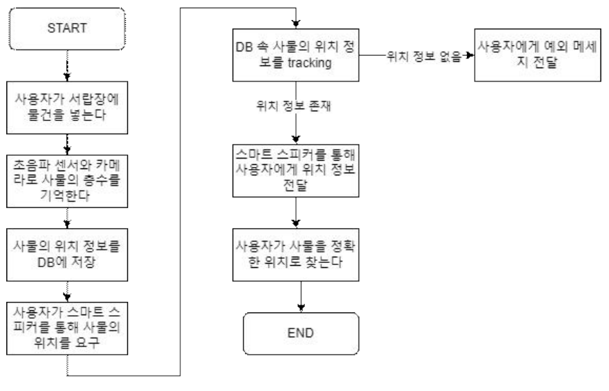
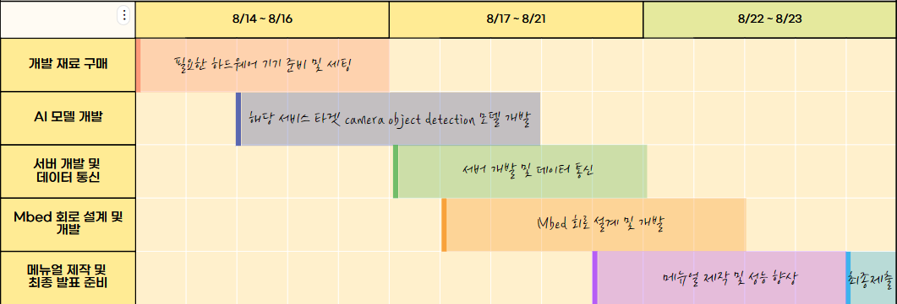

# ing 스마트 서랍장
## 문제점
* 노화가 진행될 수록 기억력이 감퇴되어 일상생활에 지장이 간다.
* 현대인들은 과도한 디지털 기기 사용으로 건망증 및 디지털 치매 증후군 문제가 대두되고 있다.
* 따라서 우리는 기억력 문제를 보조할 수 있는 서비스를 제공하고자 한다.
* 사용자가 과도한 보조를 받는다는 인식을 받지 않도록, 일상생활에서 쉽게 이용할 수 있는 형태로 제작할 예정이다.
## 유즈케이스

## Work breakdown sheet​

## high level design

## Members
|Name|Role|
|-|-|
|이원제|서버 구축, 발표|
|권오윤|3D 모델링, MCU 설계|
|이송이|AI 모델 학습|
|이정은|Mbed 개발|
|임사랑|Mbed 개발|
